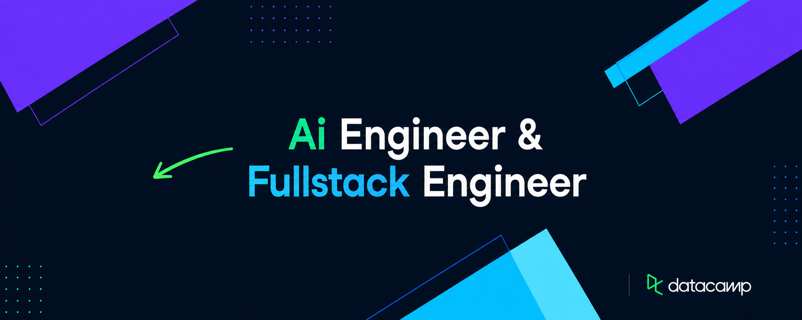

<!--
HOW TO USE THIS TEMPLATE
1. Create a repo named EXACTLY your GitHub username (e.g. Harry197-beep/Harry197-beep)
2. Public repo, check "Add a README file"
3. Replace this file's content with this template
4. Find/replace every Harry197-beep, YOUR_LINKEDIN, etc. below with your real links
-->

<!-- ===== BANNER (your own image) ===== -->
<!-- Upload banner.png to an "assets" folder in this repo, then this path will work -->

<!-- ===== BADGES ROW (shields.io) ===== -->

## 👋 Salam kenal, aku **Harry**

**AI Engineer** (no-code automation + code-based AI agents, data training/SFT specialist) and **Fullstack Engineer** (frontend + backend, Python/HTML/JS/CSS), from Indonesia.

I help growing companies implement AI/ML and automation so they can make better decisions and move faster — with hands-on experience across ML, cybersecurity, data science/analytics, and finance.

Outside of code, you'll find me building multi-agent systems, breaking things on purpose to learn how they work, or shipping something at 2am.

---

### 🧠 What I do

- 🤖 **AI Agents & Automation** — no-code automation pipelines + custom-coded agentic systems
- 🎯 **Data Training / SFT** — fine-tuning and supervised training pipelines
- 💻 **Fullstack Development** — Python & JS/HTML/CSS, frontend to backend
- 📊 **ML / Data Science** — end-to-end pipelines, from EDA to deployed models
- 🔐 **Cybersecurity** — applied security work across projects
- 💰 **Finance** — quant/trading systems and financial data analysis

---

### 🚀 What I'm building

- **Agentic Innovations** — AI agency for SMEs & e-commerce (AI agents, automation, consulting)
- **sales_swarm** — multi-agent B2B outbound sales pipeline
- **IDX AI Hedge Fund** — multi-agent trading system for Indonesian equities

---

### 📊 GitHub Stats

<!-- Replace Harry197-beep below with your actual GitHub username -->

### 🏆 Trophies

---

### 🛠️ Tech Stack

<!--
NOTE: Pinned repos are NOT part of this README.
Set them from your profile page → click "Customize your pins" → choose up to 6 repos.
-->
